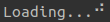
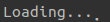
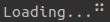
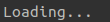

# aloader: A simple loader animation for Python terminal applications

aloader provides an easy to use and simple wrapper for functions/iterables that take long enough time to warrant some feedback to a user. In order to use aloader simply wrap your function or process with a `with` statement, passing a message string and style string to the `aloader.Loader()` class. There are currently 8 animations based of clever rearrangements of the braille alphabet. aloader is intended to be lightweight and only depend upon core Python packages.

## Usage

To use `aloader` import the package and use a `with` statement with the `Loader` class.

```python
import aloader

with aloader.Loader("Loading...", "Done!", style="shuffle"):
    # some process
```
## Animation styles

These are the supported animations. Specify which animation you desire by with the `sytle` parameter of `aloader.Loader`.

| Style | Animation |
| :---: | :---: |
| `block-rotate` |  |
| `block-build` |  |
| `block-destroy` |  |
| `block-shuffle` |  |
| `block-fall` |  |
| `block-rise` |  |
| `stream-down` |  |
| `stream-up` |  |

## Credit

This project was inspired and directly adapted from [this](https://stackoverflow.com/a/66558182) excellent stackoverflow post from ted.