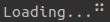

# aloader
A Python package that provides interesting and informative loading animations.

## Usage

To use `aloader` import the package and use a `with` statement with the `Loader` class.

```python
import aloader

with aloader.Loader("Loading...", "Done!", style="shuffle"):
    # some process
```
## Animation styles

Supported animation styles.

| Style | Animation |
| :---: | :---: |
| `block-rotate` |  |
| `block-build` |  |
| `block-destroy` |  |
| `block-shuffle` |  |
| `block-drop` | |
| `block-lift` | |
| `stream-down` | |
| `stream-up` | |