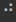

# aloader
A Python package that provides interesting and informative loading animations.

## Usage

To use `aloader` import the package and use a `with` statement with the `Loader` class.

```python
import aloader

with aloader.Loader("Loading...", "Done!", style="shuffle"):
    # some process
```
## Animation styles

| Style | Animation |
| :---: | :---: |
| rotate |  |
| build | 